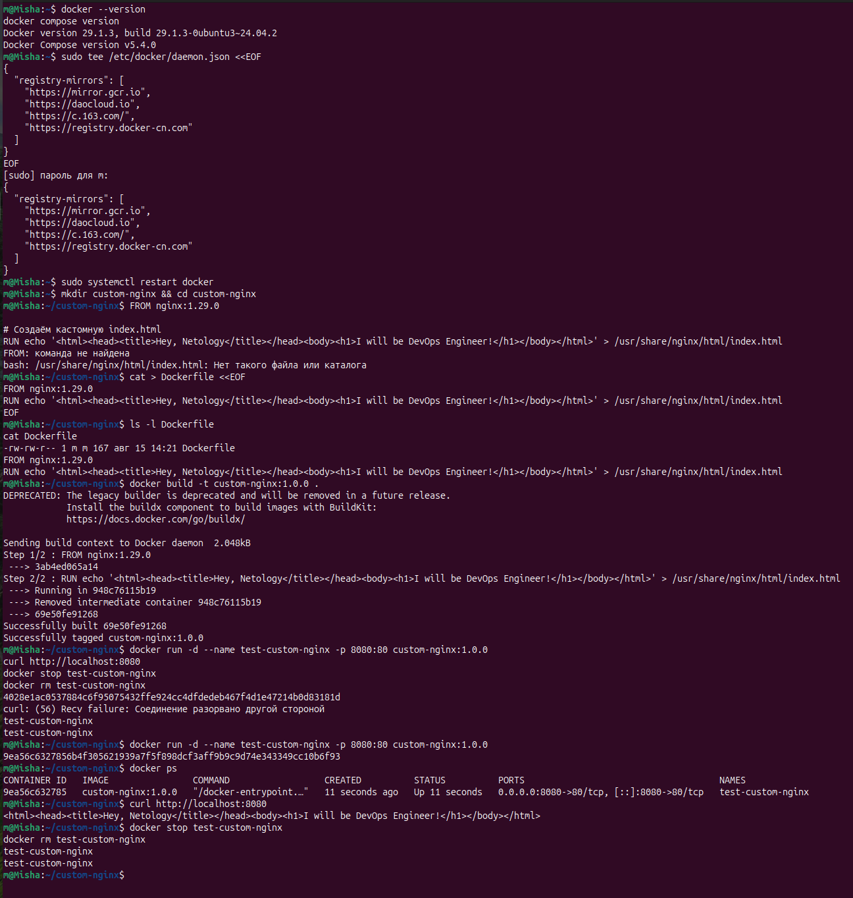
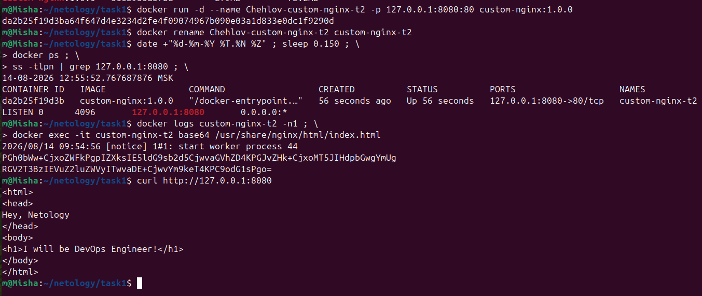

# ДЗ: Оркестрация группой Docker контейнеров

## Задача 1. Установка Docker, сборка и публикация образа Nginx
 Доступ к Docker Hub отсутствует, образ собран локально




## Задача 2. Запуск, переименование, проверка контейнера

### Выполненные действия
Запуск контейнера с пробросом порта только на localhost:

  

## Задача 3. Часть 1: остановка контейнера через Ctrl+C

### Выполненные действия

1. Запуск контейнера в интерактивном режиме:
   ```bash
   docker run -it --name custom-nginx-demo -p 127.0.0.1:8082:80 custom-nginx:1.0.0
```
```
### Результаты

    Контейнер custom-nginx-demo остановлен, статус Exited (0).
    В логах видно, что главный процесс Nginx получил сигнал SIGINT, корректно завершил все worker‑процессы и завершил работу.
    Это демонстрирует, что в Docker состояние контейнера напрямую зависит от состояния его главного процесса: при его завершении контейнер считается остановленным.
```
```

### Часть 2: правка конфига Nginx и проблема маппинга портов

### Действия и результаты

| Действие | Команда | Результат |
| --- | --- | --- |
| Правка конфига | `vim /etc/nginx/conf.d/default.conf` → `listen 81;` → `:wq` | Конфиг изменён, Nginx будет слушать порт 81 |
| Перезагрузка Nginx | `nginx -s reload` | Конфигурация применена без полного рестарта |
| Проверка внутри контейнера | `curl http://127.0.0.1:81` | Страница доступна |
| Проверка снаружи (до исправления) | `curl http://127.0.0.1:8080` | Страница **недоступна** (маппинг на порт 80, а Nginx слушает 81) |
| Исправление маппинга | `docker run ... -p 127.0.0.1:8080:81` | Страница снова доступна |

### Вывод

Изменение порта внутри контейнера (`listen 81`) без корректировки маппинга приводит к недоступности сервиса снаружи. Проблема решается пересозданием контейнера с корректным маппингом портов. Это показывает важность соответствия портов внутри контейнера и на хосте.
```
```
## Задача 4: общие тома (volumes) между разными ОС

Цель: продемонстрировать, что данные, хранящиеся в Docker-томе, доступны из разных контейнеров (в том числе на разных дистрибутивах Linux).

### Подготовка: создание общей директории на хосте

```bash
mkdir -p ~/docker-volumes/shared-data
echo "Hello from Ubuntu host" > ~/docker-volumes/shared-data/host-file.txt
```

```
```
## Задача 5: Portainer, локальный Registry и управление стеками

### Цель
Научиться управлять несколькими compose‑файлами, использовать локальный Docker Registry, деплоить стеки через Portainer и анализировать конфигурацию контейнеров.

### Ключевые команды

```bash
mkdir -p /tmp/netology/docker/task5
cd /tmp/netology/docker/task5
# Созданы compose.yaml и docker-compose.yaml

# Запуск обоих файлов
docker compose -f compose.yaml -f docker-compose.yaml up -d

# Подготовка и загрузка образа в локальный registry
docker tag custom-nginx:latest 127.0.0.1:5000/custom-nginx:latest
docker push 127.0.0.1:5000/custom-nginx:latest

# Удаление файла и демонстрация warning
rm compose.yaml
docker compose up -d
# Вывод: warning о том, что compose.yaml не найден


# Остановка проекта одной командой
docker compose down
### Удаление манифеста и очистка orphan-контейнеров

1. Файл `docker-compose.yaml` был удалён из директории проекта.
2. При запуске `docker compose up -d` без compose-файла Docker обнаружил «осиротевшие» контейнеры и выдал предупреждение с рекомендацией использовать флаг `--remove-orphans`.
3. Для очистки был выполнен:  
   ```bash

   docker compose up -d --remove-orphans
После удаления docker-compose.yaml попытка запуска через docker compose up -d привела к ошибке no configuration file provided: not found.
Контейнеры проекта (task5-*) остались в системе как orphan-контейнеры. Поскольку compose‑файл отсутствовал, флаг --remove-orphans не мог быть применён.
Для очистки проекта была использована команда прямого удаления контейнеров:
bash

docker rm -f $(docker ps -aq --filter name=task5)


